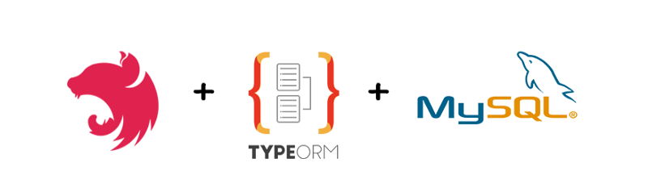

# NestJs-Starter

This project is sample application that demonstrates storing and receiving data in MySQL database using NestJS framework
and TypeORM.

Additionally, it shows how to activate Swagger(OpenApi) documentation to automatically generate an REST-API



## Database setup

In order to start this sample, please make sure that you specify the right data for establishing MySQL connection (in `
ormconfig.json` file, make sure that `username`, `password` and `database` values matches your MySQL server values):

```
{
    "type": "mysql",
    "host": "localhost",
    "port": 3306,
    "username": "nestuser",
    "password": "nestpw",
    "database": "nestdb",
    "entities": ["dist/**/*.entity{.ts,.js}"],
    "synchronize": true
}
```

## Install Dependencies

### APP

Then please install all the app depencencies by executing the following command:

```
npm install
```

### DB

To install a Mysql-Database you can use the predefined docker-compose.db.yml. This file contains all informtaion to
setup an docker comntainer with the same credentials from `ormconfig.json`. If you updated this file you have to update
docker-compose also. You can start the db with:

```
npm run db:start
```

To stop run:

```
npm run db:stop
```

If you dont want to use Docker you have to setup your own Mysql-Instance with credentials from `ormconfig.json`

## Run

You can run the app by executing the following command:

```
npm run start:dev
```
